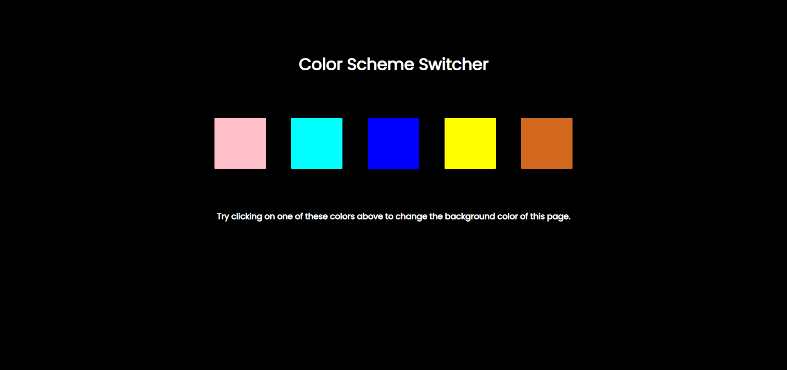

# Background Color Switcher

The Background Color Switcher is a lightweight web application developed using HTML, CSS, and JavaScript. It enables users to dynamically change the background color of webpages with ease.

## Usage

1. Clone or download the repository.
2. Open the `index.html` file in your web browser.
3. Click on the color palette to change the background color of the webpage instantly.

## Features

- Instantly change the background color of webpages.
- Lightweight and easy to use.
- Built with HTML, CSS, and JavaScript.

Feel free to contribute or report issues!

